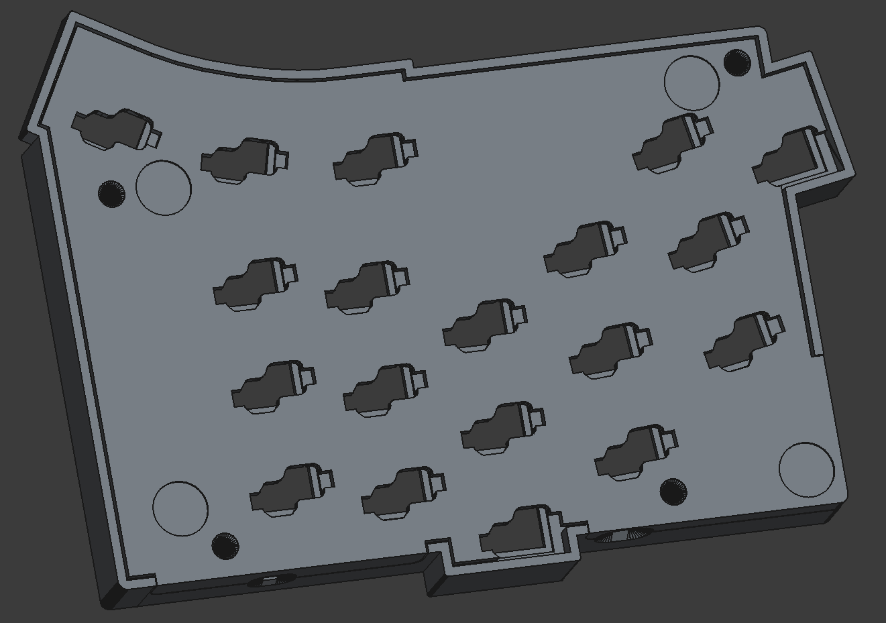

# main changes:
* battery is now over diodes
* widened case to store battery 7x15x40 ~ 350 mAh
* canal for battery cables
* m2 inserts instead of standoffs
* height increased by 0.7 mm

* bottom left

* bottom right

* logo 2x size

* d20 variant

# TODO
* test if it works